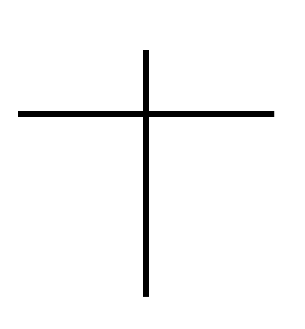
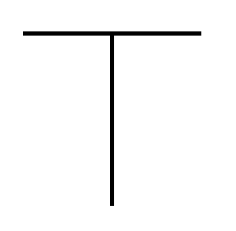
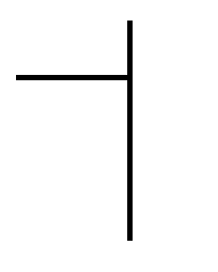
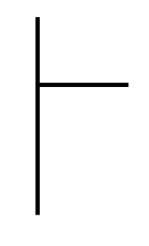
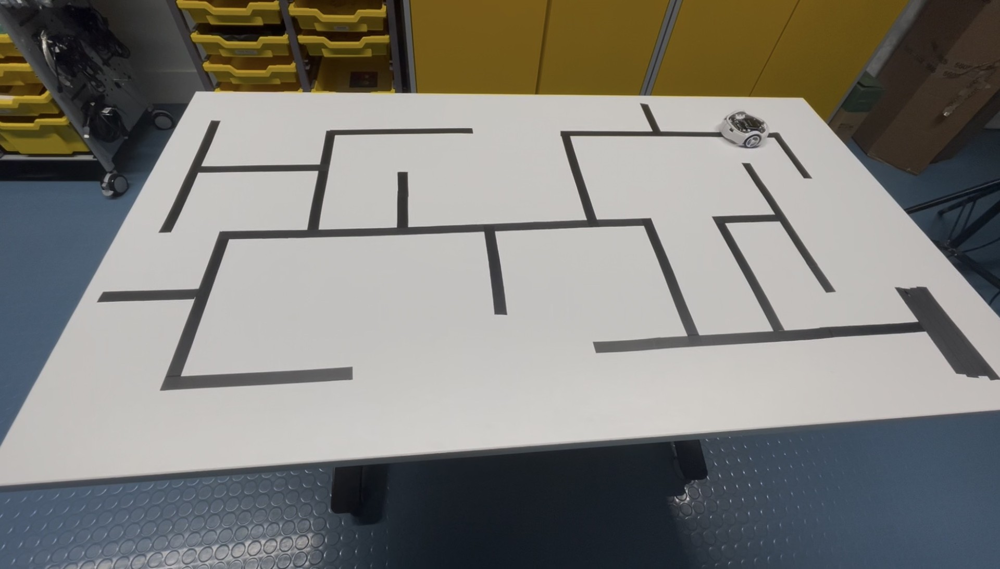

# Maze Solving Robot
This is a Pololu 3PI project, where a pololu should be able to follow, solve, remember said solution and follow a maze again with no wrong turns.

## Hardware
- Pololu 3PI
- USB Micro B Cable

## Software
- Arduino IDE
- Pololu A-Star Boards
- Pololu3piPlus32U4 Library

## Other Materials Needed
- White, Smooth Tabel/ Surface
- Black tape
- Bright lighting

# Getting started
## Software
Installing the Boards and Library:  
**Boards**
1. In the Arduino IDE, open the File menu (Windows/Linux) or the Arduino menu (macOS) and select "Preferences".
2. In the Preferences dialog, find the "Additional Boards Manager URLs" text box. Copy and paste the following URL into this box:

https://files.pololu.com/arduino/package_pololu_index.json

If there are already other URLs in the box, you can either add this one separated by a comma or click the button next to the box to open an input dialog where you can add the URL on a new line.

3. Click the "OK" button to close the Preferences dialog.
4. In the Tools > Board menu, select "Boards Manager..." (at the top of the menu).
5. In the Boards Manager dialog, search for "Pololu A-Star Boards".
6. Select the "Pololu A-Star Boards" entry in the list, and click the "Install" button.

**Library**
1. In the Arduino IDE, open the sketch menu and select "Include Library" --> "Manage Libraires"
2. In the Library Manager search for 'Pololu3piPlus32U4'
3. Click the "Install" button

To run the software:
1. Clone git https://github.com/gracemartin29/MazeSolverBase.git
2. Open in Arduino IDE
3. Connect the Pololu to computer through its USB Micro B port at the back, and select on the IDE
4. Upload the code to the Pololu

## Setting up the Maze
The Pololu can turn left and right corners and deal with 4 different Junctions:
- Cross  

- T  

- Half T (Left)  

- Half T (Right)   

Use the tape on the table/ surface to build your maze, keeping your lines as clean and straight as possible.

To make the finish line layer multiple lines of tape to make a thick recktangle.

**Example:**  

## Following the Maze!
1. Place the Pololu at the start of the maze, ensuring it's as straight on the line as you can get.
2. Press 'B' to calabrate the Pololu
3. Once it has finished calabrating, presh 'B' again and it should start following the maze.

4. Once it's reached the finish line, and now knows the quickest path to get through the maze, place the pololu back at the start of your maze and press 'B' again.

It should now go through the maze without making any unnecessary detors.

## Usage
fake end